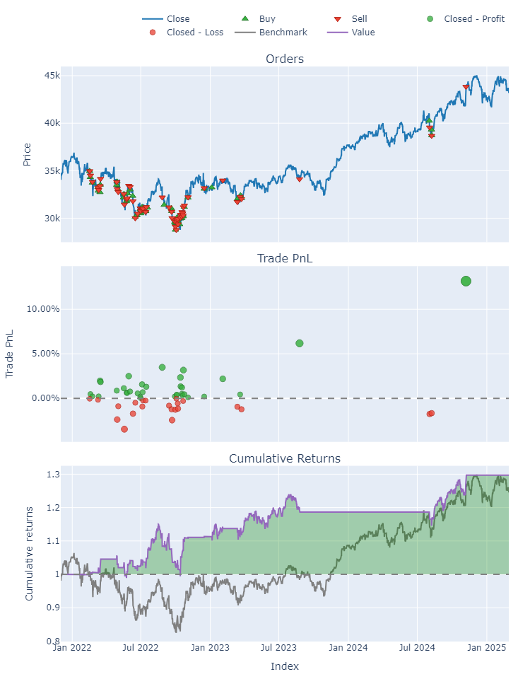

# AlphaFlow ML & DL Trading Bot Project

A comprehensive **machine learning and deep learning trading framework** that covers the entire workflow:

1. **Data loading** from MetaTrader 5
2. **Feature engineering** (technical indicators, custom features, labeling)
3. **Model training** (RandomForest, XGBoost, LightGBM, deep learning models, etc.)
4. **Hyperparameter tuning** (RandomizedSearchCV, GridSearchCV or Optuna)
5. **Time-based / walk-forward cross-validation**
6. **Backtesting** (VectorBT or simple custom code)
7. **Live trading** integration with MetaTrader 5

### Supported Strategies:
- **Regression** on next-bar returns
- **Multi-bar classification**
- **Double-barrier labeling** (López de Prado style)
- **Regime detection** (simple up/down/sideways approach)
- **Momentum Strategy**
- **Pairs Trading (Cointegration)**
- **Pairs Trading (Clustering)**

This project provides a flexible **template** for you to **create and add your own** custom labeling functions or feature engineering steps, allowing you to experiment with new ideas and strategies.

## Table of Contents
1. [Features](#features)
2. [Repository Structure](#repository-structure)
3. [Setup & Installation](#setup--installation)
4. [Usage](#usage)
    - Backtesting Notebooks
    - Live Trading Scripts
5. [Key Modules](#key-modules)
6. [Extending the Project](#extending-the-project)
7. [Disclaimer](#disclaimer)
8. [License](#license)

## Features
- **MetaTrader 5** data retrieval (`data_loader.py`)
- **TA** library for feature engineering (`ta.add_all_ta_features`)
- Multiple **labeling methods**: next-bar, multi-bar, double-barrier, regime detection, etc.
- **Time-based** or **walk-forward** cross-validation to avoid data leakage
- **RandomizedSearchCV** or **GridSearchCV** for hyperparameter tuning
- **VectorBT** or custom backtesting scripts for performance evaluation
- **Live trading** scripts with real-time MetaTrader 5 order sending

## Repository Structure
```bash
# AlphaFlow ML & DL Trading Bot Repository Structure

AlphaFlow-MT5-ML-DL-Trading-Lab/
├── data/
│   ├── data_loader.py              # MetaTrader 5 data retrieval
│
├── features/
│   ├── feature_engineering.py      # Technical indicators, stationarity checks, custom features
│   ├── labeling_schemes.py         # Labeling methods: next-bar, multi-bar, double-barrier, regime detection
│
├── models/
│   ├── model_training.py           # Model selection, hyperparameter tuning (Optuna, GridSearchCV)
│   ├── saved_models/               # Folder for saved model pipelines (.pkl, .joblib)
│
├── backtests/
│   ├── simple_backtest.py          # Simple event-driven backtest logic
│   ├── vectorbt_backtest.py        # VectorBT-based backtesting template
│
├── live_trading/
│   ├── ... (live trading scripts)
│
├── notebooks/
│   ├── exploratory/
│   │   ├── eda_visualization.ipynb
│   │   ├── integrated_pipeline_pair_trading.ipynb
│   │   └── kalman_filters_solution.ipynb
│   ├── strategies/
│   │   ├── ml/
│   │   │   ├── backtesting/
│   │   │   │   ├── regression_returns.ipynb
│   │   │   │   ├── double_barrier_labeling.ipynb
│   │   │   │   ├── multi_bar_classification.ipynb
│   │   │   │   ├── multi_bar_classification_multisymbol.ipynb
│   │   │   │   ├── multi_bar_classification_multisymbol_core_features.ipynb
│   │   │   │   ├── multi_bar_classification_multisymbol_core_features_stocks.ipynb
│   │   │   │   ├── regime_detection.ipynb
│   │   │   │   ├── momentum_strategy.ipynb
│   │   │   │   ├── pairs_trading_cointegration.ipynb
│   │   │   │   └── pairs_trading_clustering.ipynb
│   │   │   └── live_trading/
│   │   │       ├── regression_returns.ipynb
│   │   │       ├── double_barrier_labeling.ipynb
│   │   │       ├── multi_bar_classification.ipynb
│   │   │       ├── multi_bar_classification_multisymbol_core_features.ipynb
│   │   │       ├── regime_detection.ipynb
│   │   │       ├── pairs_trading_cointegration.ipynb
│   │   │       └── pairs_trading_clustering.ipynb
│   │   └── dl/
│   │       ├── backtesting/
│   │       │   ├── regression_returns.ipynb
│   │       │   └── multi_bar_classification_multisymbol.ipynb
│   │       └── live_trading/
│   │           └── regression_returns.ipynb
│   └── time_series/
│       └── arima_sarima_var_lstm.ipynb
│
├── requirements.txt
├── README.md
```

## Setup & Installation

### 1. Clone this repository:
```bash
git clone https://github.com/maghdam/AlphaFlow-Trading-Bot.git
cd ml_bot_trading
```

### 2. Create and activate a Python environment (conda or venv):
```bash
conda create -n ml_trading python>=3.9
conda activate ml_trading
```

### 3. Install dependencies:
```bash
pip install -r requirements.txt
```
- Make sure you have **MetaTrader5** installed [IC Markets MT5](https://www.icmarkets.com/global/en/forex-trading-platform-metatrader/metatrader-5).

### 4. (Optional) Install Jupyter Notebook:
```bash
pip install jupyter
```

## Usage
### Backtesting Notebooks
1. Navigate to `ml_notebooks/` or `dl_notebooks/`, pick a relevant file (e.g., `02_backtests_multi_bar_classification.ipynb`), and run it:
   ```bash
   jupyter notebook
   ```
2. Inside the notebook, you can see how we do:
   - Feature engineering
   - Labeling
   - Walk-forward splits
   - Train & tune
   - VectorBT or custom backtesting

### Live Trading Scripts
1. Navigate to `ml_notebooks/` or `dl_notebooks/`, pick a relevant live trading file (e.g., 2_live_trading_multi_bar_classification.ipynb), or go to `live_trading/` folder and pick the script for your labeling approach:
   - `regression_returns.py`
   - `multi_bar.py`
   - `double_barrier.py`
   - `regime_detection.py`
2. Adjust **MetaTrader 5 credentials** (login, server, password) in the script.
3. Run from terminal:
   ```bash
   python live_trading/multi_bar.py.py
   ```
4. The script will:
   - Load the pipeline (e.g., `best_rf_mb_pipeline.pkl`)
   - Fetch new bars from MetaTrader 5
   - Predict SHIFTED classes `[0, 1, 2]` => SHIFT back to `[-1, 0, +1]`
   - Place orders if signals = ±1

## Key Modules
- **`data/data_loader.py`**: Connects to MetaTrader 5, fetches bars with `copy_rates_from_pos`.
- **`features/feature_engineering.py`**: Uses the **TA** library and additional custom features (spreads, autocorrelation, etc.).
- **`features/labeling.py`**:
  - `calculate_future_return(...)`
  - `create_labels_multi_bar(...)`
  - `create_labels_double_barrier(...)`
  - `create_labels_regime_detection(...)`
- **`models/model_training.py`**:
  - `select_features_rf_reg(...)`
  - Time-based splits, random/grid search for hyperparams.
- **`backtests/`**:
  - `simple_backtest.py` or `vectorbt_backtest.py`
- **`live_trading/`**:
  - Each script loads a pipeline (`.pkl`), connects to MT5, and places trades based on predictions.

## Extending the Project
- **Add your own label**: Create a new function in `features/labeling.py` (e.g. `create_labels_custom(...)` that returns a new column with `[-1, 0, +1]` (or your custom classes)).
- **Add your own features**: Implement them in `features/feature_engineering.py` or create a new file.
- **Train a new model**: Adapt `models/model_training.py` or your notebooks to handle new classifiers/regressors.
- **Explore new backtest approaches**: Either integrate with `vectorbt` in a notebook or write a custom `.py` in `backtests/`.

## Disclaimer
We share this code for **learning and development/research purposes only**. Nothing herein constitutes financial advice or a recommendation to trade real money. **Trading involves substantial risk.** Always do your own due diligence, consult professionals, and only risk capital you can afford to lose.

## License
This project is licensed under the **MIT License** - see the [LICENSE](LICENSE) file for details.


## Backtest Results - US30 - H4


```
Loaded best classification model from 'best_rf_mb_pipeline.pkl'

Out-of-Sample Accuracy: 0.5439

Running Full Backtest on the Last 5000 Bars...
```

```
Full Backtest Results:
Accuracy=0.54, Return=0.30%, Sharpe=1.21
Start                               2021-12-01 16:00:00
End                                 2025-02-28 00:00:00
Period                                832 days 12:00:00
Start Value                                     10000.0
End Value                                  12971.402323
Total Return [%]                              29.714023
Benchmark Return [%]                          24.515943
Max Gross Exposure [%]                            100.0
Total Fees Paid                              236.291366
Max Drawdown [%]                              13.645737
Max Drawdown Duration                 295 days 04:00:00
Total Trades                                         56
Total Closed Trades                                  56
Total Open Trades                                     0
Open Trade PnL                                      0.0
Win Rate [%]                                  60.714286
Best Trade [%]                                13.156291
Worst Trade [%]                               -3.463323
Avg Winning Trade [%]                          1.517335
Avg Losing Trade [%]                          -1.094661
Avg Winning Trade Duration    7 days 03:03:31.764705882
Avg Losing Trade Duration               1 days 00:00:00
Profit Factor                                  2.150809
Expectancy                                    53.060756
Sharpe Ratio                                    1.20547
Calmar Ratio                                   0.885441
Omega Ratio                                    1.156419
Sortino Ratio                                  1.793852
dtype: object

```




